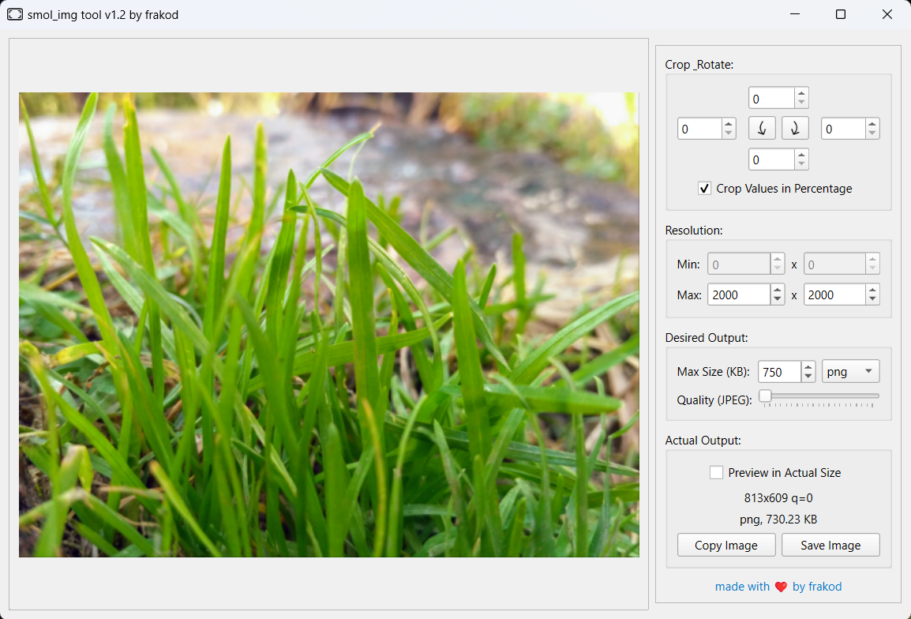
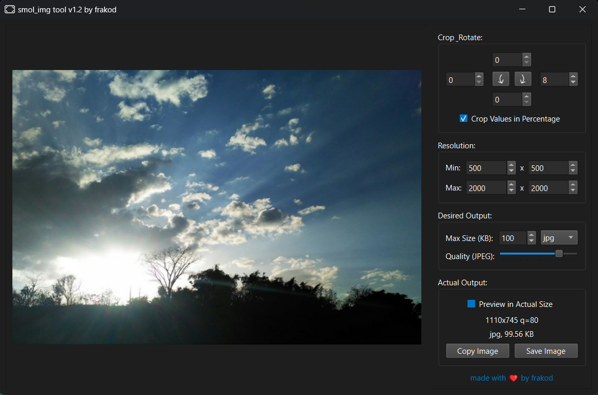

# 🖼️ smol_img
A tool to Crop, Rotate and Resize Images to desired target File Size.

Useful for online forms that require image uploads with specific size and resolution requirements.

- **Output Formats :** JPEG, PNG
- **Input Formats :** JPEG, PNG, WEBP, HEIC, BMP, TGA, TIFF, SVG (partial), PDF (single page), GIF (non animated), ICO (partial)
- Percentage Based or Pixel Based Cropping
- Automatic Optimization of Resolution and Quality to achieve target Size
- Image rotation in 90° multiples

# ⚡ installation
- Prebuilt binaries for Windows available in [Releases](https://github.com/frak0d/smol_img/releases). Prefer using qt6 based 64bit version.
- For ArchLinux based distros, [smol_img](https://aur.archlinux.org/packages/smol_img) package is available via AUR.
- For other distros/mac os, compile from source.

# 💻 screenshots
|          Light Theme            |           Dark Theme           |
| :-----------------------------: | :----------------------------: |
|  |  |
